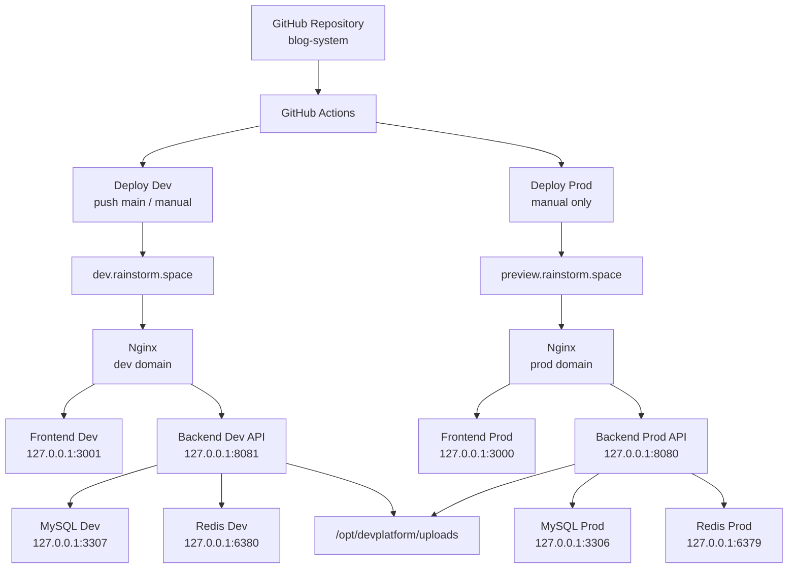
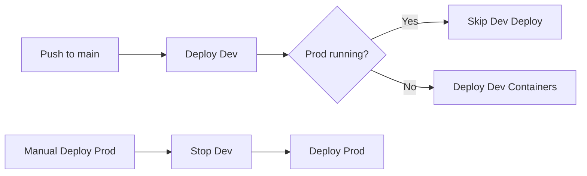
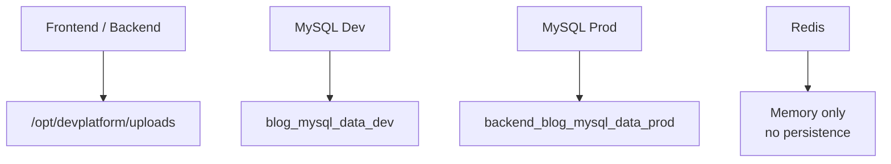
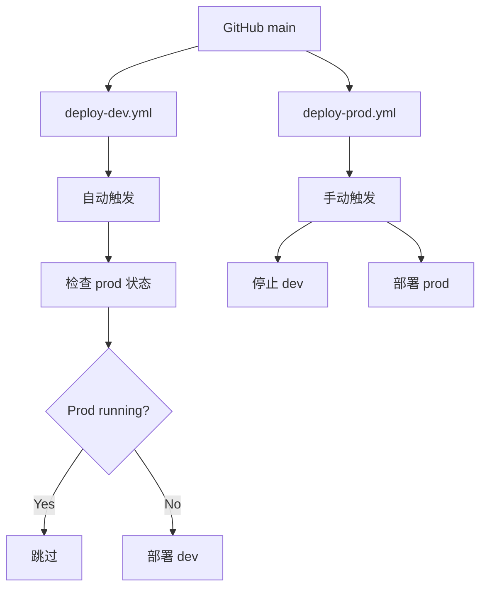
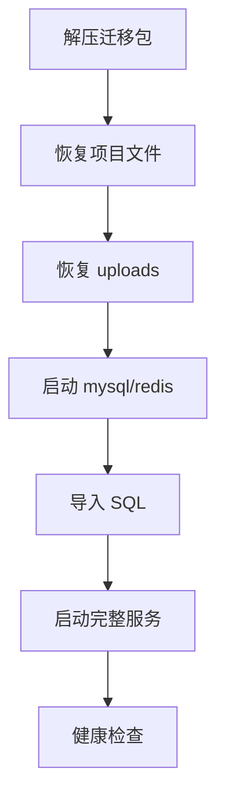
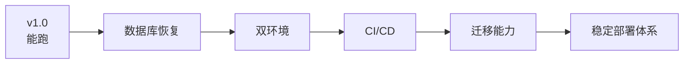

# 📦 Blog System Architecture Overview

## 1. 项目概述

Blog System 当前已经从单机开发项目，演进为具备基础工程化能力的系统，支持：

- Dev / Prod 双环境隔离
- GitHub Actions 自动部署（Dev）+ 手动发布（Prod）
- Docker Compose 容器化运行
- MySQL 持久化存储
- Uploads 文件共享
- 一键迁移（打包 + 恢复）
- 部署冲突保护（Prod 运行时禁止 Dev 覆盖）

---

## 2. 总体架构图



---

## 3. 环境划分

### Dev 环境

| 组件 | 端口 |
|------|------|
| Frontend | 3001 |
| Backend | 8081 |
| MySQL | 3307 |
| Redis | 6380 |

### Prod 环境

| 组件 | 端口 |
|------|------|
| Frontend | 3000 |
| Backend | 8080 |
| MySQL | 3306 |
| Redis | 6379 |

---

## 4. Dev / Prod 切换逻辑



### 说明

- Dev：自动部署（push main）
- Prod：仅手动触发
- 防冲突机制：
  - Prod 运行时，Dev 自动跳过部署
  - Prod 部署会主动停止 Dev

---

## 5. Docker 架构

### Dev Compose

- `compose.dev.yml`
- 本地开发模式（挂载源码）
- MySQL / Redis 独立端口

### Prod Compose

- `compose.prod.yml`
- 使用 `.env.prod`
- 使用独立 MySQL 数据卷（external）

---

## 6. 数据持久化



### 说明

- Uploads：共享目录（Dev / Prod 共用）
- MySQL：
  - Dev：本地 volume
  - Prod：external volume（重要数据）
- Redis：当前无持久化（缓存用途）

---

## 7. CI/CD 架构



---

## 8. 迁移能力（核心能力）

### 打包脚本

`scripts/package-migration.sh`

包含：

- project 配置
- deploy 文件
- scripts
- docs
- nginx 配置
- MySQL dump
- uploads
- docker 状态

---

### 恢复脚本

`scripts/restore-migration.sh <archive>`

流程：



---

## 9. 版本策略

| 版本 | 含义 |
|------|------|
| v1.0.0 | first production baseline |
| v1.1.0 | deployment stabilized |
| v1.x.x | 持续演进 |

### 原则

- 不删除历史 tag
- 每个稳定阶段打 tag
- 用于回滚 / 对比 / 迁移基线

---

## 10. 回滚策略

### 回滚代码
```
git fetch --tags
git reset --hard <tag>
```

### 回滚 Dev
```
docker compose -f deploy/compose.dev.yml up -d --build
```

### 回滚 Prod
```
docker compose --env-file deploy/.env.prod -f deploy/compose.prod.yml up -d --build
```

⚠️ 数据库不会随 tag 自动回滚，需要手动恢复 dump

---

## 11. 当前系统能力总结

当前 Blog System 已具备：

- ✅ 双环境隔离（Dev / Prod）
- ✅ 自动部署（Dev）+ 手动发布（Prod）
- ✅ Docker 标准化运行
- ✅ 数据持久化（MySQL + uploads）
- ✅ 环境迁移能力（可跨机器恢复）
- ✅ 部署冲突保护机制
- ✅ 基础可回滚能力

---

## 12. 后续优化方向

- Redis 持久化（AOF）
- 数据库权限拆分（避免 root）
- Nginx / 域名语义统一
- CI 增加测试阶段
- 分支策略（main / release）
- 监控 & 告警（Prometheus / Grafana）

---

## 13. 阶段演进



---

# 📌 总结

Blog System 已从：

👉 单机开发项目

演进为：

👉 **具备基础工程化能力的可部署、可迁移系统**
